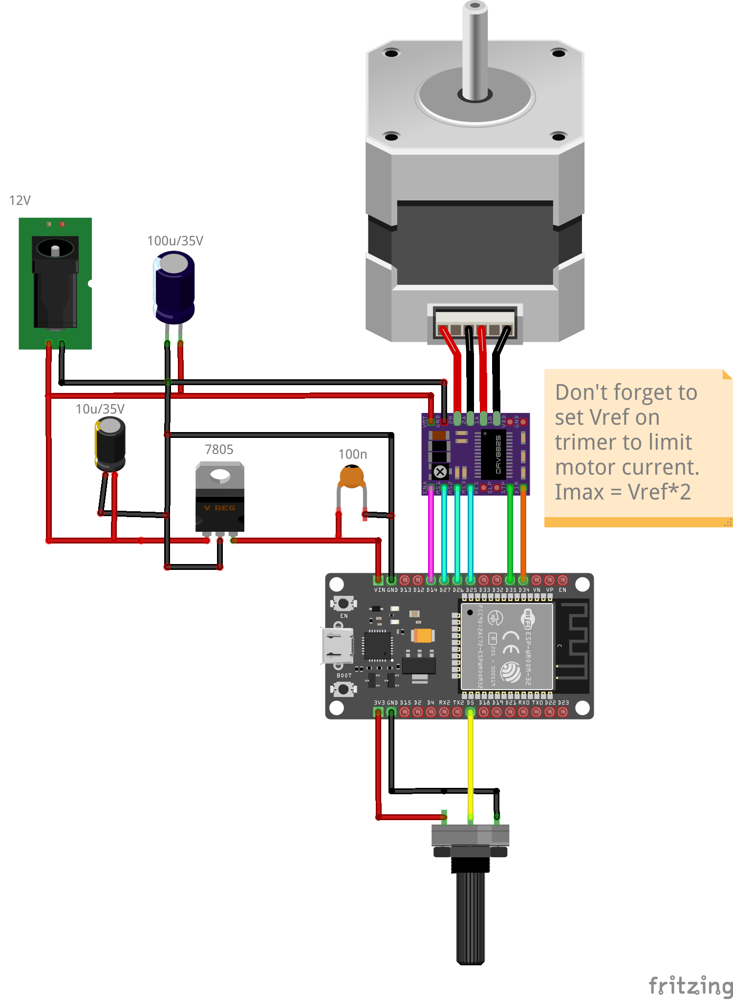

# About
This is code for my version of DIYbio Orbital Shaker V1.0 from  https://www.thingiverse.com/thing:2633507
Which using `motion_link_new.stl`, `motion_link_motor.stl` and `Shaker_PlatformSupportV2.stl` from https://www.thingiverse.com/thing:6132449

Main difference is that I am using ESP32-C3 dev board instead of Arduino that enables me to use WIFI and control and suervise shaker via web browser, any ESP32 should work.

# Take care of
- input and output pins, I don't have the same esp32 as on schematic, so pinout in my code is different. Just set pin numbers for motor and potentiometar correctly
- Set Vref on DRV8825 to limit maximal current

# TODO
- Potentiometar takes over on change, Web control takes back on change from it.
- Add code to set M0, M1, M2, Enable for DRV8825 from web interface
- 
